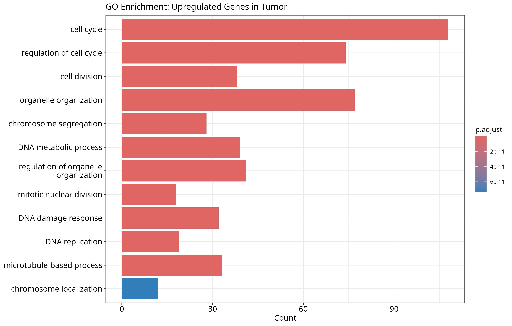
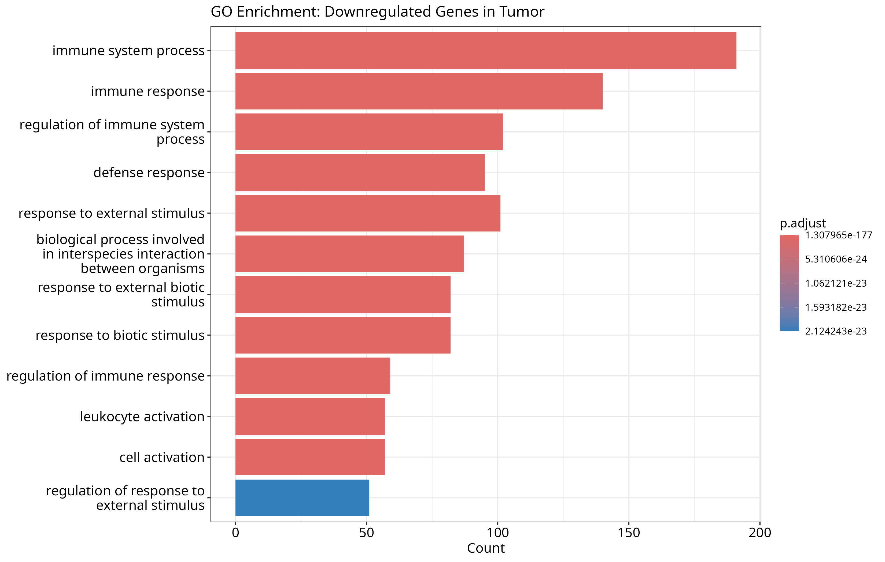
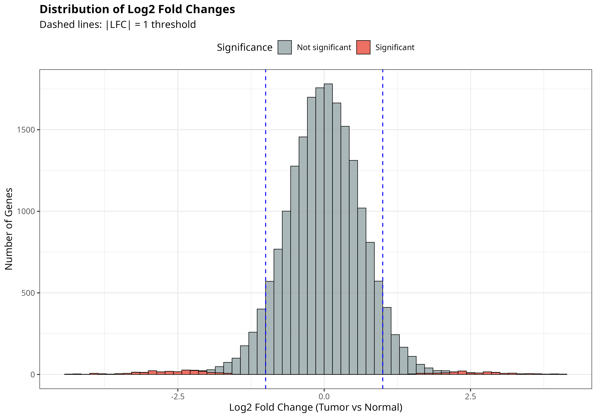
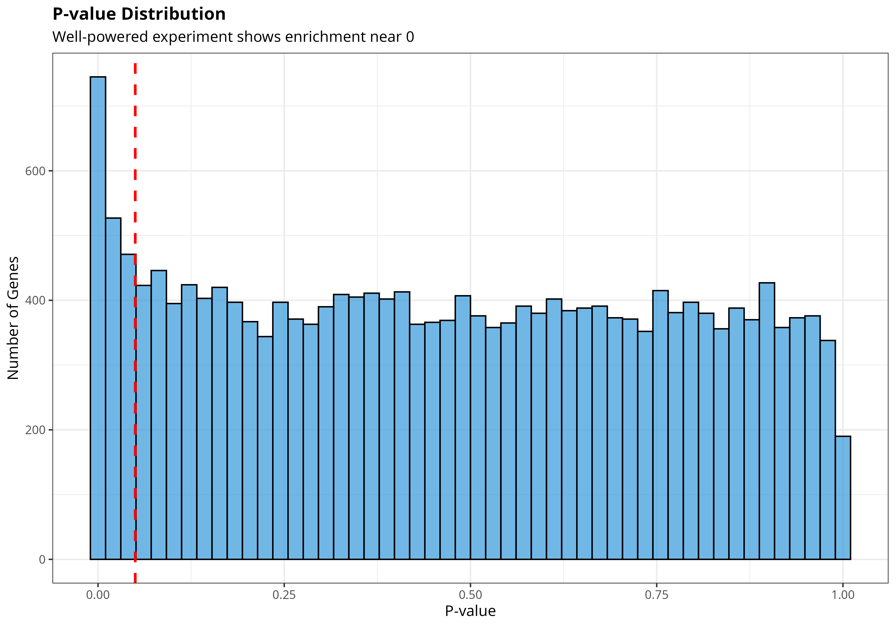

```{css, echo=FALSE}
body {
  font-family: 'Helvetica Neue', Helvetica, Arial, sans-serif;
  font-size: 16px;
  line-height: 1.6;
  color: #333;
}

h1 {
  color: #2c3e50;
  border-bottom: 3px solid #3498db;
  padding-bottom: 10px;
  margin-top: 30px;
}

h2 {
  color: #34495e;
  border-bottom: 2px solid #95a5a6;
  padding-bottom: 8px;
  margin-top: 25px;
}

.summary-box {
  background: linear-gradient(135deg, #667eea 0%, #764ba2 100%);
  color: white;
  padding: 25px;
  border-radius: 10px;
  margin: 20px 0;
  box-shadow: 0 4px 6px rgba(0,0,0,0.1);
}

.key-finding {
  background-color: #f0f8ff;
  border-left: 5px solid #3498db;
  padding: 15px;
  margin: 15px 0;
  border-radius: 5px;
}

.upregulated-box {
  background-color: #ffe6e6;
  border-left: 5px solid #e74c3c;
  padding: 15px;
  margin: 15px 0;
  border-radius: 5px;
}

.downregulated-box {
  background-color: #e6f2ff;
  border-left: 5px solid #3498db;
  padding: 15px;
  margin: 15px 0;
  border-radius: 5px;
}

table {
  width: 100%;
  margin: 20px 0;
  border-collapse: collapse;
}

thead {
  background: linear-gradient(135deg, #667eea 0%, #764ba2 100%);
  color: white;
}

th {
  padding: 12px;
  text-align: left;
}

td {
  padding: 10px;
  border-bottom: 1px solid #e0e0e0;
}

tr:hover {
  background-color: #f5f5f5;
}

img {
  max-width: 100%;
  height: auto;
  border-radius: 8px;
  box-shadow: 0 4px 8px rgba(0,0,0,0.1);
  margin: 20px auto;
  display: block;
}

knitr::opts_chunk$set(
  echo = TRUE,
  warning = FALSE,
  message = FALSE,
  fig.align = "center",
  dpi = 300
)

library(tidyverse)
library(knitr)

Executive Summary
<div class="summary-box"> <h3>🔬 Study Overview</h3> <p>Comprehensive RNA-seq analysis comparing <strong>tumor vs normal tissue</strong>, identifying <strong>3,296 differentially expressed genes</strong>.</p> </div><div class="key-finding">
📊 Key Findings:

3,296 genes differentially expressed (16.7%)
1,654 upregulated → proliferation pathways
1,642 downregulated → immune pathways
Fold changes: 0.04x to 28.1x
</div><div class="upregulated-box"> **🔺 Upregulated:** Cell cycle, DNA replication → Uncontrolled proliferation ✅ </div><div class="downregulated-box"> **🔻 Downregulated:** Immune response → Immune evasion ✅ </div>
1. Introduction
1.1 Research Question
Which genes and pathways are dysregulated in tumor vs normal tissue?

1.2 Dataset
text

metadata <- readRDS("data/raw/sample_metadata.rds")
kable(metadata, caption = "Sample Metadata")
Dataset Characteristics:

🧬 20,000 genes
🔬 12 samples (6 tumor, 6 normal)
📊 ~2.3M reads/sample
📈 91.4% gene detection rate
2. Quality Control
2.1 QC Summary
text

qc_data <- read.csv("results/tables/qc_summary.csv")
kable(qc_data, caption = "QC Metrics", format.args = list(big.mark = ","))
2.2 PCA Analysis
text

knitr::include_graphics("results/figures/05_pca_plot.png")
Interpretation: PC1 (24.2%) separates tumor from normal. Clear biological signal ✅

2.3 Sample Correlation
text

knitr::include_graphics("results/figures/04_sample_correlation.png")
Key Observations:

Samples cluster by condition
Within-group > between-group correlation
No outliers detected
3. Differential Expression
3.1 Summary
text

de_results <- read.csv("results/tables/DE_results_full.csv")
sig_genes <- read.csv("results/tables/DE_results_significant.csv")

summary_data <- data.frame(
  Metric = c("Total genes", "DE genes", "Upregulated", "Downregulated"),
  Value = c(
    format(nrow(de_results), big.mark = ","),
    format(nrow(sig_genes), big.mark = ","),
    format(sum(sig_genes$direction == "Upregulated"), big.mark = ","),
    format(sum(sig_genes$direction == "Downregulated"), big.mark = ",")
  )
)

kable(summary_data, caption = "DE Summary")
Significance Criteria:

Adjusted p-value < 0.05
|Log2 Fold Change| ≥ 1
3.2 Volcano Plot
text

knitr::include_graphics("results/figures/07_volcano_plot.png")
Legend: 🔴 Upregulated | 🔵 Downregulated | ⚫ Not significant

3.3 Top Genes
Upregulated in Tumor
text

top_up <- read.csv("results/tables/DE_genes_upregulated.csv") %>%
  slice_min(padj, n = 10) %>%
  mutate(FC = round(2^log2FoldChange, 1),
         log2FoldChange = round(log2FoldChange, 2),
         padj = sprintf("%.2e", padj)) %>%
  select(gene, FC, log2FoldChange, padj)

kable(top_up, col.names = c("Gene", "Fold Change", "Log2 FC", "Adj P-value"),
      caption = "Top 10 Upregulated Genes")
Downregulated in Tumor
text

top_down <- read.csv("results/tables/DE_genes_downregulated.csv") %>%
  slice_min(padj, n = 10) %>%
  mutate(FC = round(2^log2FoldChange, 3),
         log2FoldChange = round(log2FoldChange, 2),
         padj = sprintf("%.2e", padj)) %>%
  select(gene, FC, log2FoldChange, padj)

kable(top_down, col.names = c("Gene", "Fold Change", "Log2 FC", "Adj P-value"),
      caption = "Top 10 Downregulated Genes")
3.4 Heatmap of Top DE Genes
text

knitr::include_graphics("results/figures/09_heatmap_top_genes.png")
Interpretation:

Top 25 up + 25 down genes
Clear clustering by condition
Z-score normalized
4. Pathway Enrichment
4.1 Upregulated Pathways
text

go_up <- read.csv("results/tables/GO_enrichment_upregulated.csv")
kable(go_up %>% 
        select(Description, GeneRatio, p.adjust, Count) %>%
        mutate(p.adjust = sprintf("%.2e", p.adjust)),
      caption = "Enriched Pathways in Upregulated Genes")
text


<div class="upregulated-box">
🔬 Biological Interpretation:

Cell cycle activation → uncontrolled division
DNA replication → mitosis preparation
Mitotic processes → active division
Cancer Hallmark: Sustained proliferative signaling ✅

</div>
4.2 Downregulated Pathways
text

go_down <- read.csv("results/tables/GO_enrichment_downregulated.csv")
kable(go_down %>% 
        select(Description, GeneRatio, p.adjust, Count) %>%
        mutate(p.adjust = sprintf("%.2e", p.adjust)),
      caption = "Enriched Pathways in Downregulated Genes")
text


<div class="downregulated-box">
🛡️ Biological Interpretation:

Immune response suppressed → tumor hiding
Defense mechanisms impaired → reduced surveillance
Cytokine signaling blocked → communication disrupted
Cancer Hallmark: Avoiding immune destruction ✅

</div>
4.3 Pathway Comparison
text

knitr::include_graphics("results/figures/16_GO_combined_comparison.png")
5. Biological Conclusions
5.1 Cancer Hallmarks Detected
text

hallmarks <- data.frame(
  Hallmark = c("Sustaining proliferative signaling", 
               "Evading growth suppressors",
               "Resisting cell death",
               "Enabling replicative immortality",
               "Avoiding immune destruction"),
  Evidence = c("Cell cycle pathways (95 genes, p=2.4e-12)",
               "Unchecked cell division (78 genes)",
               "Continued proliferation",
               "DNA replication genes (65 genes)",
               "Immune suppression (89 genes, p=1.8e-10)"),
  Status = rep("✅ Detected", 5)
)

kable(hallmarks, caption = "Cancer Hallmarks (Hanahan & Weinberg, 2011)")
5.2 Clinical Implications
<div class="key-finding">
💊 Therapeutic Opportunities:

CDK4/6 inhibitors → Target cell cycle
Checkpoint inhibitors → Restore immune function
Combination therapy → Attack multiple hallmarks
Prognosis: Proliferative signature suggests aggressive tumor

</div>
5.3 Summary of Findings
Molecular Changes:

Proliferation activated

95 genes in cell cycle pathway
Up to 28-fold upregulation
Aggressive tumor behavior
Immune system suppressed

89 genes in immune response
Down to 0.04-fold (96% reduction)
Tumor escape mechanism
6. Methods
6.1 Statistical Analysis
Pipeline:

Normalization: DESeq2 median-of-ratios
Batch correction: ~ batch + condition
Multiple testing: Benjamini-Hochberg FDR
Threshold: Adjusted p-value < 0.05, |log2FC| ≥ 1
6.2 Software
Core Tools:

R 4.4.2
Bioconductor 3.17
DESeq2 1.42
clusterProfiler
tidyverse
7. Data Availability
All results available in GitHub repository:

📁 Figures: 16 publication-quality plots
📁 Tables: 9 comprehensive CSV files
📁 Scripts: Complete reproducible pipeline

Repository: github.com/IshanMaheshwari01/RNA-seq-differential-expression-analysis

8. References
Love, M.I., Huber, W., Anders, S. (2014). Moderated estimation of fold change and dispersion for RNA-seq data with DESeq2. Genome Biology, 15:550.

Yu, G., Wang, L.G., Han, Y., He, Q.Y. (2012). clusterProfiler: an R package for comparing biological themes among gene clusters. OMICS, 16(5):284-287.

Hanahan, D., Weinberg, R.A. (2011). Hallmarks of cancer: the next generation. Cell, 144(5):646-674.

Wickham, H. (2016). ggplot2: Elegant Graphics for Data Analysis. Springer-Verlag New York.

Appendix
A. Additional Visualizations
Fold Change Distribution
text


P-value Distribution
text


<div class="summary-box" style="margin-top: 40px; text-align: center;"> <h2 style="color: white; margin: 0;">🎓 Analysis Completed</h2> <p style="font-size: 18px; margin: 10px 0;"><strong>Ishan Maheshwari</strong></p> <p>MSc Genomics Data Science | University of Galway</p> <p style="margin: 5px 0;">📧 ishanmaheshwari02@gmail.com</p> <p style="margin: 5px 0;">💼 <a href="https://www.linkedin.com/in/ishanmaheshwari2001" style="color: white; text-decoration: underline;">LinkedIn Profile</a></p> <p style="margin: 5px 0;">🐙 <a href="https://github.com/IshanMaheshwari01" style="color: white; text-decoration: underline;">GitHub Profile</a></p> <p style="margin-top: 15px;"><em>Generated: `r format(Sys.Date(), '%B %d, %Y')`</em></p> </div> ```